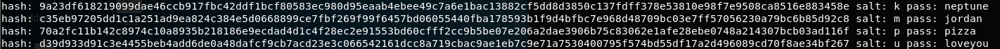

Writeup 9 - Crypto I
=====

Name: Bryan Soriano
Section: 0101

I pledge on my honor that I have not given or received anyunauthorized assistance on this assignment or examination.

Digital acknowledgement of honor pledge: Bryan Soriano

## Assignment 9 Writeup

### Part 1 (60 Pts)
For the first part, I first read in the files (hashes, probable-v2-top1575.txt). I then stripped the new line character from each line, and added each hash and word to lists named hashes, and passlist. Next, I iterated through the list of possible salts (a-z), and appended each salt to each word from the passlist. I then hashed the salted words using SHA512, and checked if they were in the hashes list. At first this was not working because I did not have the hexdigest() command, which converts the hash object into a string. After adding this command, I was able to receive the output seen in the screenshot below:

### Part 2 (40 Pts)
For the second part, I started off by just running the stub part2.py code to see what information the server was sending. I saw that each time the server would send something like "Find me the [hash] of [string]". I tried to nc into it and manually provide the hash, and that's when I saw that it said "Correct!", and then sent another hash to compute. I figured it would keep doing this for a while, so I started to write the code that could do this.

I had to extract parts of the string that followed a certain pattern, so I ended up just using regex. The regex I used was "Find me the (.+?) hash of (.\*)", which gave me the hash to use in the first parentheses, and the string to hash in the second parentheses.

